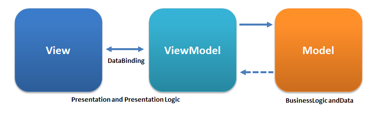

# Image Editor

Приложение, которое позволяет редактировать фотографии.

## Стэк

- SwiftUI
- MVVM
- Photos
- Combine
- PencilKit
- FirebaseAuth

## Архитектура

В качестве архитектуры используется MVVM (Model-View-ViewModel).

### Описание MVVM

MVVM разделяет код на три основные компоненты:

1. **Model** – содержит данные и бизнес-логику приложения. Например, модель фотографии, текстовых объектов и фильтров.
2. **View** – отвечает за отображение интерфейса пользователю. В SwiftUI это структуры `View`, которые реагируют на изменения состояния.
3. **ViewModel** – посредник между Model и View. Обрабатывает данные модели и предоставляет их в форме, удобной для отображения во View. Также обрабатывает пользовательские события и обновляет Model.

### Схема MVVM

### Схема Модулей

## Документация

### 1) Регистрация 

Для регистрации нажмите на кнопку "Sign Up" на окне авторизации. Появится окно регистрации.

Введите все необходимые данные и нажмите на кнопку "Sign Up". В случае удачной регистрации аккаунта, вас вернет на окно авторизации.

Что бы закрыть окно авторизации просто нажмите на кнопку "Back" в верхнем левом углу экрана.

### 2) Авторизация 

Что бы авторизоваться просто введите почту и пароль от своего аккаунта и нажмите на кнопку "Sign In".

Так же авторизоваться можно через Google. Для этого просто нажмите на кнопку "Sign In with Google". 
Расположенная ниже кнопки "Sign In". Далее следуйте инструкциям.

После авторизации появится экран с коллекцией изображений взятых с вашего устройства.

Что бы выйти обратно на жкран авторизации, необходимо, на экране коллекции изображений, нажать на кнопку "Sign Out" в левом верзнем углу экрана. 

### 3) Сброс пароля

Для сброса пароля нажмите на кнопку "Forgot my password". В появившемся окне просто введите почту котороя привязанна к аккаунту. На данный адрес придет письмо с сбросом пароля. 

### 3) Выбор изображения для редактирования

Что бы можно было выбрать изображение, просто выберите доступное изображение из коллекции. Обязательно дайте доступ к библиотеке изображений. 

Так же изображение можно сделать при помощи камеры. Для этого нажмите на кнопку с иконкой камеры. Обязательно дайте доступ к камере для данного функционала.

После того, как изображение будет выбрана, откроется окно редактирования изображения. 

Что бы отменить редактирование, нажмите на кнопку "Cancel" в верхнем левом углу экрана окна редактирования.

### 3) Редактирование изображения
#### 3.1) Масштабирование

Изображение можно масштабировать и поворачивать при помощи жеста "Pinch to zoom".

#### 3.2) Добавление фильтров

К изображению можно добавить фильтр. Для этого нажмить на кнопку "Filters" на панели инструментов внизу.

В появившемся окне, выберите нужный фильтр из списка.

#### 3.3) Рисование

На изображение можно нанести рисунок. Для этого на панели инструментов нажмите на кнопку "Draw".

Появится панель для выбора цвета и кистей. На изображении можно рисовать пальцем или Apple Pencil.

Для заверщения нажмите на кнопку "Done" в верхнем парвом углу экрана.

#### 3.4) Добавдление текста

На изображение можно добавить текст. Для этого на панели инструментов нажмите на кнопку "Text".

Появится панель инструментов на которой можно выбрать: шрифт, цвет, и размер шрифта. Нажмите на кнопку "+" для добавления текста на рисунок.

Появившийся текст можно перетаскивать по экрану при помощи жеста "Drag and drop"

Для завершения редактирования нажмите на кнопку "Done" в верхнем парвом углу экрана.

#### 3.4) Сохранение и Шеринг

Что бы сохранить на устройство изображение просто нажмите на иконку диска в правом верхнем углу экрана и в появившемся окне выберите кнопку "Save to Photos".

Что бы сохранить на устройство изображение просто нажмите на иконку диска в правом верхнем углу экрана и в появившемся окне выберите кнопку "Share".

Что бы закрыть появившееся окно, нажмите на кнопку "Cancel".

